Due to significant changes in Tea the Story 2.0, this guide provides necessary explanations.

---

## Wild Crops

In the current version, seeds can no longer be obtained by breaking grass. Instead, you can find wild versions of crops or their seeds in nearby villages.

There are currently seven types of wild crops:
- Wild Rice
- Wild Tea
- Wild Grapes
- Wild Cucumber
- Wild Bitter Melon
- Wild Chili
- Wild Cabbage

Wild rice typically grows near freshwater sources, while tea plants thrive in moist mountain biomes.

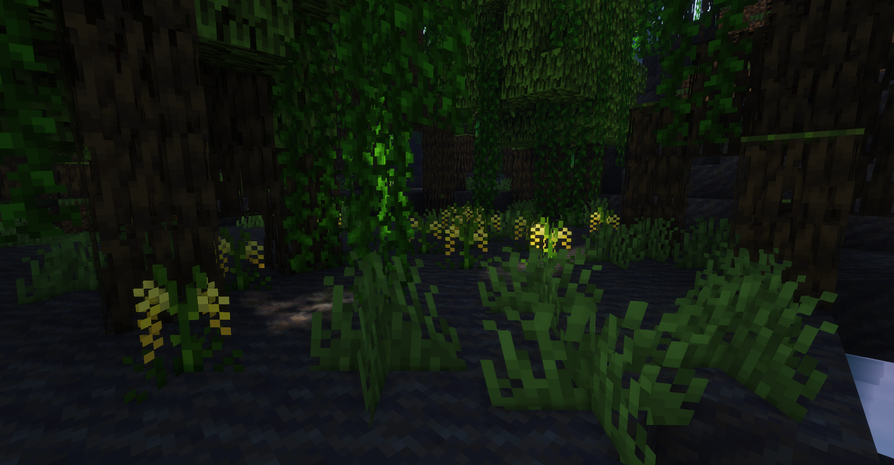  
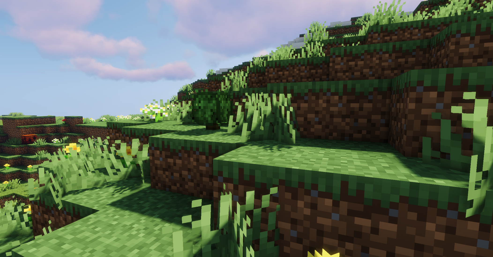

---

## Irrigation

Tea the Story introduces a unique farmland irrigation system: **aqueducts**.  
Aqueducts can transport water over long distances to irrigate farmland when connected to a water source block.

There are three types of aqueducts, each obtained by digging specific blocks with an **aqueduct shovel**:
1. **Dirt Aqueduct**: Short irrigation range.
2. **Cobblestone Aqueduct**: Longer irrigation range.
3. **Mossy Aqueduct**: Can connect to rice paddy blocks.

Use gravel to block water flow in aqueducts.

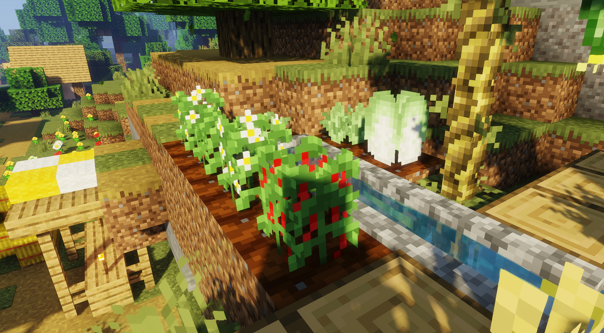

---

## Farming

Cabbage and chili in Tea the Story follow standard farming mechanics, but other crops differ.

### Rice

Rice requires a complex planting process:
1. Plant rice grains on farmland to obtain seedlings.
2. Create a **rice paddy** by tilling farmland with an aqueduct shovel.
3. Connect the paddy to water via mossy aqueducts and plant seedlings in the flooded paddy.

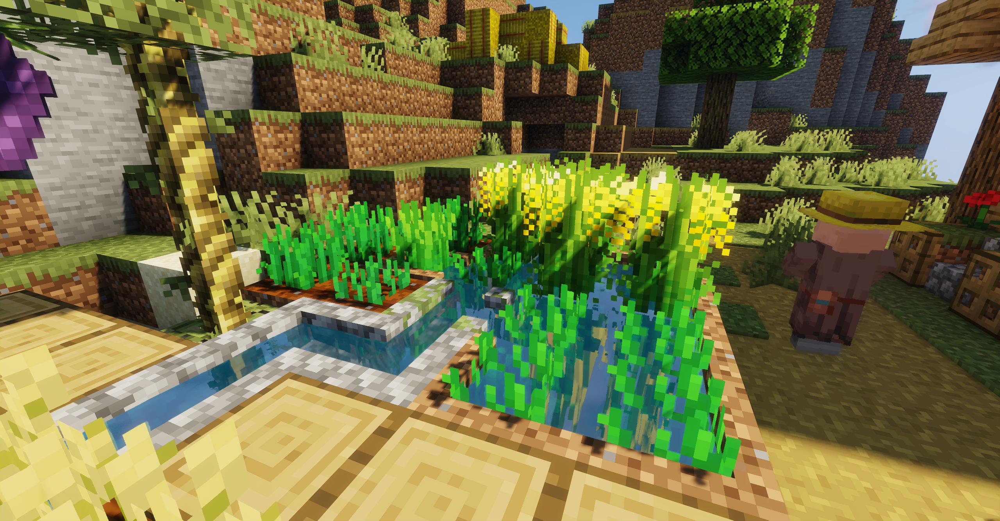

### Tea

Tea plants must be grown on farmland. Use shears to harvest leaves from mature plants. To obtain tea seeds, apply bone meal to fully mature tea plants.

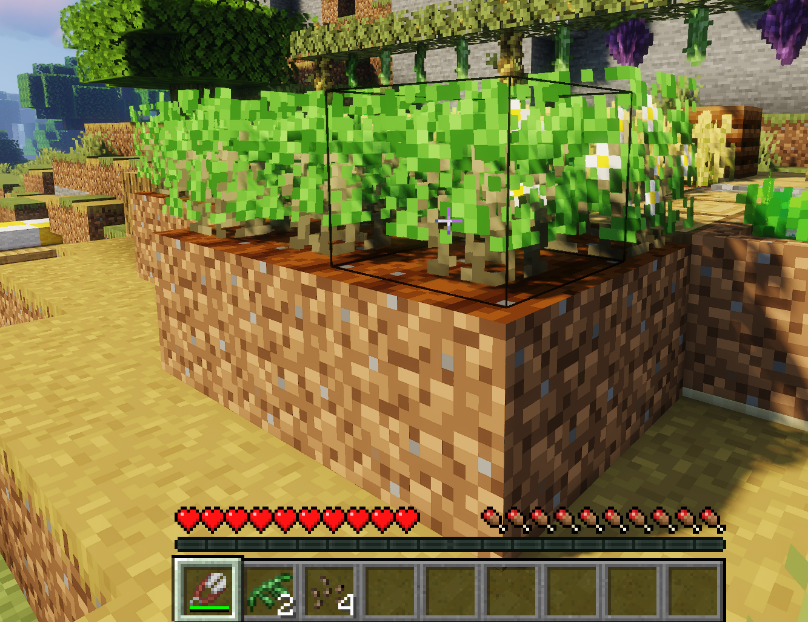

### Trellis Crops

Some crops require trellises to grow vertically. Place trellises on dirt blocks and plant the following at their base:
- Grapes
- Cucumbers
- Bitter Melons

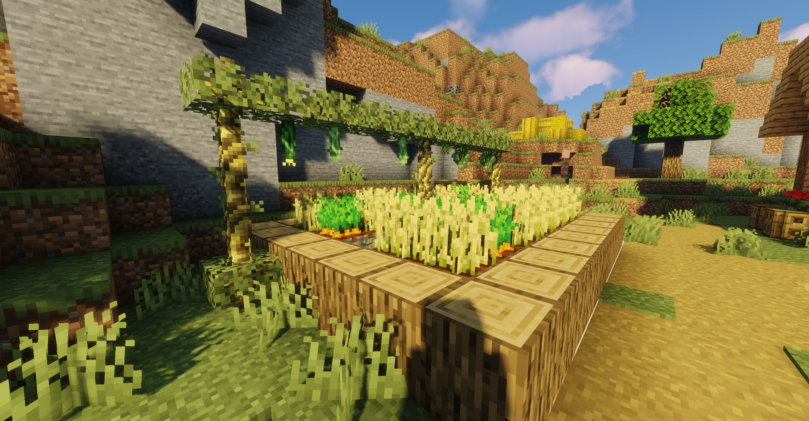

### Watermelon Vines

Watermelons now grow on vines. If the vine lacks support below, the watermelon will drop.

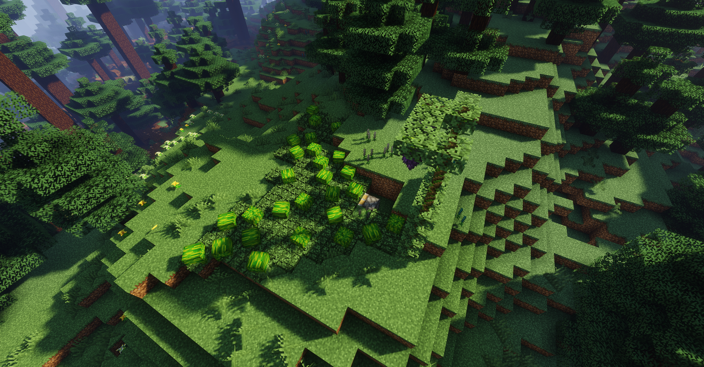

---

## Bamboo Trays

Bamboo trays have four modes:
1. **Baking Mode**: Requires a fire source beneath.
2. **Indoor Mode**: Only works indoors.
3. **Outdoor Mode**: Only works outdoors.
4. **Rain Mode**: Activates during rainfall.

Check the GUI for real-time status. Note: More items in the tray increase processing time.

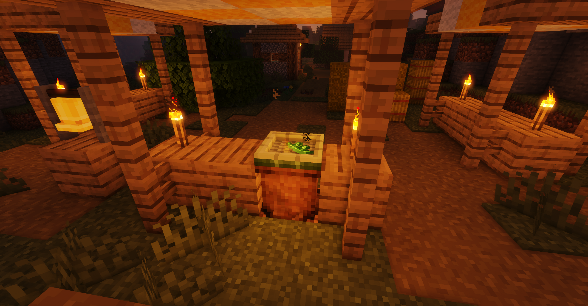

Place a tray on a catapult board to enable **automated ejection mode**.

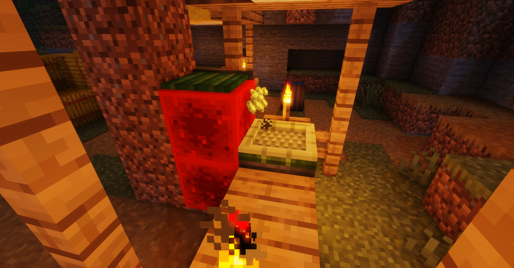

---

## Cooking Rice

1. Grind rice grains into rice.
2. Wash the rice in a wooden barrel.
3. Cook the rice in an iron pot over a fire.
    - Hold at least 8 portions.
    - Add water, cover the pot, and heat with a fire source.

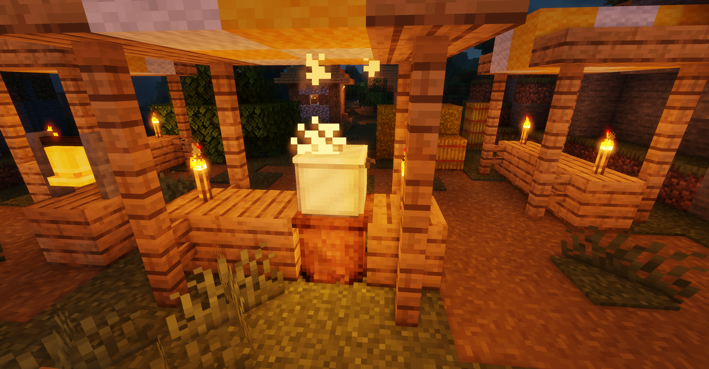

---

## Brewing Tea

Start by boiling water in a kettle over a fire.

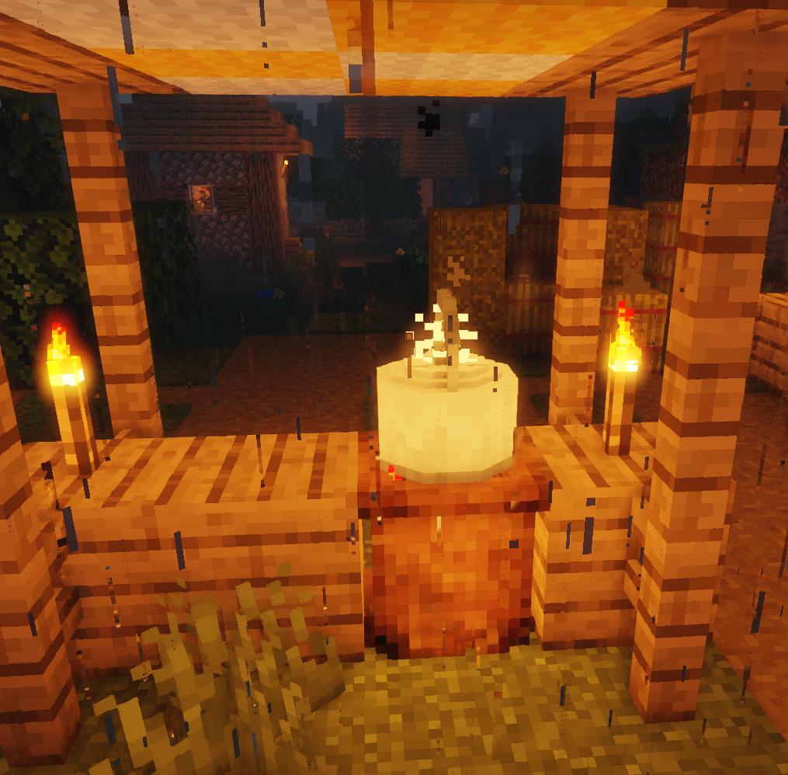

Check JEI recipes for fluid ratios. For example:
- A kettle with 2000mB (2 buckets) of boiling water requires **4+ green tea bags** to start brewing (500mB consumes 1 tea bag).

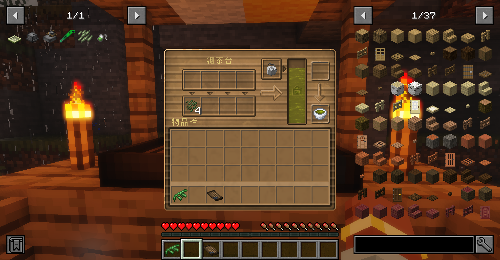

---

## Miscellaneous

### Holes

Random holes may appear in the world. After rain, bamboo grows from them.

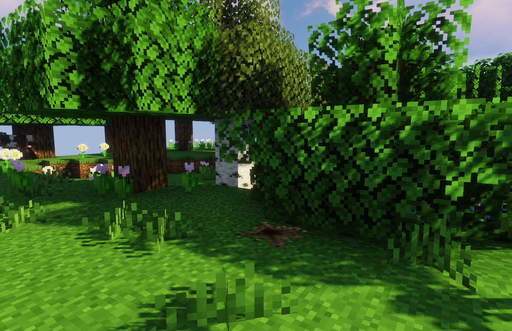

### Hybridizable Flowers

Hyacinth, chrysanthemum, and zinnia can crossbreed when densely planted. Use bone meal to accelerate hybridization.

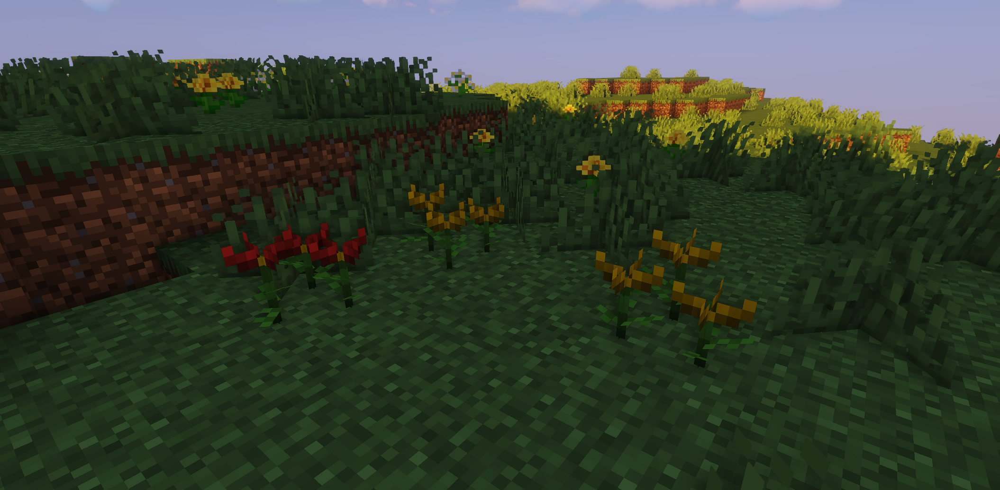  